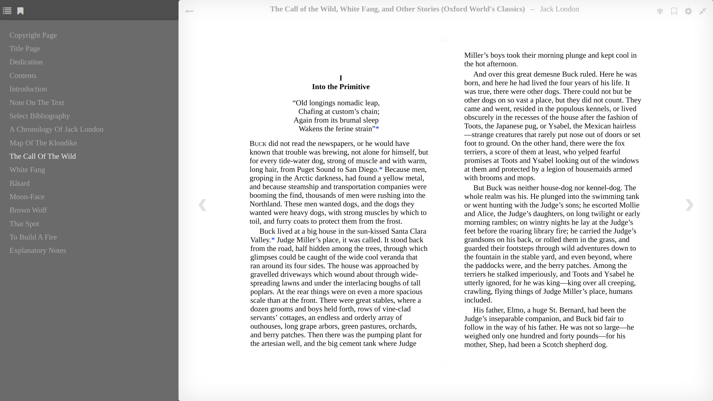

# Description

This is my solution to add a dark mode switch in calibre-web's epub reader.

As a dark mode gay, I'd like to read epub book in dark mode. And there more people want it  according to the issues. However, the author seems not to support the feature, because the epub reader is not the focus. Also I noticed that all the PRs that implemented the dark mode epub reader were rejected. So I wrote one like a patch, which can be easily installed without lots conflits.

# Screenshot




# Usage

Download the files. Copy `css` and `js` folders to `your_path_to/cps/static/`.

Edit `your_path_to/cps/templates/read.html` to import the js. For examble, you can add ```<script src="{{ url_for('static', filename='js/reading/epub_theme.js') }}"></script>``` at the end of the body element like:

```html
<!DOCTYPE html>
<html class="no-js">

      ...

      <script src="{{ url_for('static', filename='js/reading/epub.js') }}"></script>
      <!-- The code need to add -->
      <script src="{{ url_for('static', filename='js/reading/epub_theme.js') }}"></script>
      <!--  -->
    </body>
</html>
```

# Known bugs

- If the epub book has its own colors, the dark theme may not work well.
- When theme changes or epub reader changes (such as change chapter), the theme css registed in epub.js will load again. It may due to the implementation in epub.js, I think.
